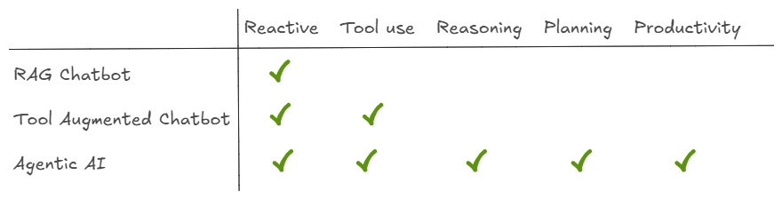

# AI Agents Tutorial
## AI Agents
Agents are systems that independently accomplish tasks. While conventional software enables users to streamline and automate workflows, agents are able to perform the same workflows on the users’ behalf with a high degree of independence.

Through agency, AI applications can be classified in two broad categories;
* **Workflow**: Build using LLM, but no agency.
* **AI Agents**: LLMs along with tools, knowledge, and memory with some level of agency.

>*Agency in AI is the ability of any AI system to detect it's environment, access tools, and perform independent actions.*




## Agentic AI
Agentic AI refer to advanced AI systems cabable of reasoning, planning, and executing complex multistep tasks independently. Often co-ordinating with other agents.

Agentic AI systems will have one or more AI agents in it performing complex tasks.

Gen AI is a component in agentic AI. Gen AI can create new content and and agentic AI can take multi-step action.


## Installation

1. **Clone the repository**:

```
git clone https://github.com/lintosunny/ai-agent-tutorial.git
```

2. **Create and activate a virtual environment (optional but recommended)**:

```
conda create -n env python=3.10 -y
```

```
conda activate env
```

3. **Install Dependencies**:

```
pip install -r requirements.txt
```

4. **Setup your API Key**:

Create a ```.env``` file in the root directory and add your Groq API key:

```
GROQ_API_KEY=your_groq_api_key_here
GOOGLE_API_KEY=your_gemini_api_key_here
```
