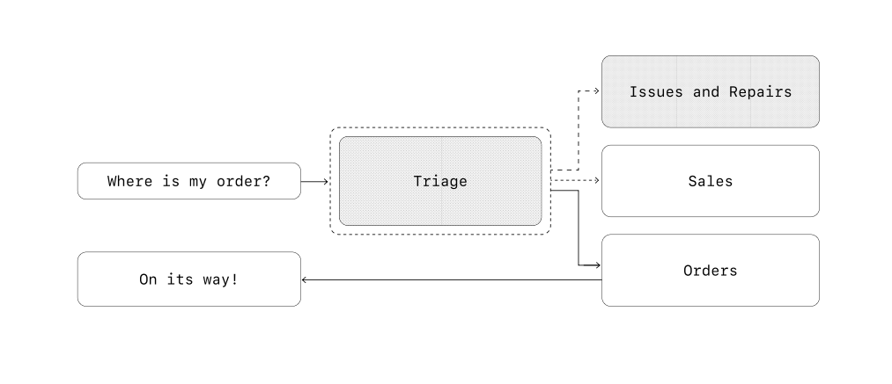

# AI Agents Tutorial
## AI Agents
Agents are systems that independently accomplish tasks. While conventional software enables users to streamline and automate workflows, agents are able to perform the same workflows on the users’ behalf with a high degree of independence.

Through agency, AI applications can be classified in two broad categories;
* **Workflow**: Build using LLM, but no agency.
* **AI Agents**: LLMs along with tools, knowledge, and memory with some level of agency.

>*Agency in AI is the ability of any AI system to detect it's environment, access tools, and perform independent actions.*


## Agentic AI
Agentic AI refer to advanced AI systems cabable of reasoning, planning, and executing complex multistep tasks independently. Often co-ordinating with other agents.

Agentic AI systems will have one or more AI agents in it performing complex tasks.

Gen AI is a component in agentic AI. Gen AI can create new content and and agentic AI can take multi-step action.


### Multi-agent systems categories
**Manager (agents as tools)**:A central “manager” agent coordinates multiple specialized agents via tool calls, each handling a specific task or domain.


**Decentralized (agents handling off to agents)**: Multiple agents operate as peers, handing off tasks to one another based on their specializations.



**When to consider creating multi agent system**: General recommendation is to maximize a single agent's capability first. More agents can provide intutive separation of concepts, but can introduce additional complexity and overhead. practical guidelines for splitting agents include;
* ***complex logic***: When prompts contain many conditional statements (multiple if-then-else branches), and prompt templates get
difficult to scale, consider dividing each logical segment across separate agents.
* ***Tool overload***: The issue isn’t solely the number of tools, but their similarity or overlap. Some implementations successfully manage more than 15 well-defined, distinct tools while others struggle with fewer than 10 overlapping tools.

## Model context Protocol (MCP)
MCP allows applications to provide context for LLMs in a standadized way, separating the concerns of providing context from the actual LLM interaction.

Think of it as a web API, but specifically designed for LLM interactions.

MCP is like a USB-C port for computers where we get a unified and standard way to connect to MCP servers. 

* **MCP server**: Refers to a server that implements the Model Context Protocol (MCP). Any MCP server exposes three categories: Tools, Resources, and Prompts.
* **MCP host**: The environment or platform that runs MCP clients and manages communication with MCP servers.
* **MCP client**: The component within the host that connects to an MCP server to use its Tools, Resources, and Prompts.


## Agent-to-Agent (A2A) Protocol
A2A allow AI agents to communicate with each other in a standadized wasy.

Introduced by Google, it allows agents to discover, communicate, and delegate tasks to one another, fostering a more interconnected and powerful AI ecosystem.


## Installation

1. **Clone the repository**:

```
git clone https://github.com/lintosunny/ai-agent-tutorial.git
```

2. **Create and activate a virtual environment (optional but recommended)**:

```
conda create -n env python=3.10 -y
```

```
conda activate env
```

3. **Install Dependencies**:

```
pip install -r requirements.txt
```

4. **Setup your API Key**:

Create a ```.env``` file in the root directory and add your Groq API key:

```
GROQ_API_KEY=your_groq_api_key_here
GOOGLE_API_KEY=your_gemini_api_key_here
```

©️ Credits: OpenAI, Anthropic, Google, and Codebasics